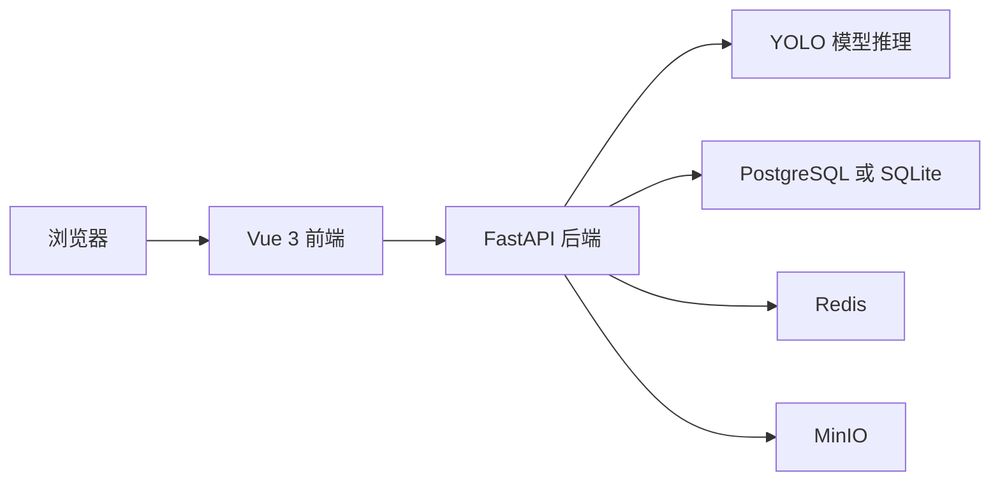

# 水果成熟度检测系统

基于 YOLO、FastAPI、Vue 3 的水果成熟度检测平台。当前仓库内置的识别类别为 4 类：未成熟香蕉、未成熟芒果、成熟香蕉、成熟芒果。

## 1. 项目概览

### 1.1 核心能力

- 用户注册、登录、会话管理
- 单图检测、批量检测、视频检测、摄像头帧检测
- 检测历史记录查询与删除
- 模型列表查询、当前模型查看、模型热重载
- Docker Compose 一键启动前后端与依赖服务

### 1.2 当前技术栈

| 层级 | 技术 |
| --- | --- |
| 前端 | Vue 3、Vite、Vue Router、Element Plus、Axios、Pinia |
| 后端 | FastAPI、Uvicorn、SQLAlchemy、Pydantic |
| 检测模型 | Ultralytics YOLO、OpenCV、Pillow、NumPy |
| 基础设施 | PostgreSQL、Redis、MinIO、Docker Compose |

### 1.3 运行架构



## 2. 仓库结构与文件说明

下面的说明以实际运行路径为准，优先覆盖旧注释和旧命名。

### 2.1 根目录

| 路径 | 作用 |
| --- | --- |
| `docker-compose.yml` | 一次性启动 PostgreSQL、MinIO、Redis、backend、frontend 五个服务 |
| `README.md` | 项目总说明文档 |
| `docs/` | 课程资料、项目介绍和按天拆分的操作教程 |
| `storage/` | 容器运行时的持久化目录，目前主要用于保存 MinIO 数据 |

### 2.2 docs 目录

| 路径 | 作用 |
| --- | --- |
| `docs/项目分组与角色分配方案.md` | 项目分工说明 |
| `docs/遥感目标检测-项目介绍.md` | 早期项目介绍文档，命名保留了旧版本内容 |
| `docs/Day1-环境搭建教程.md` | 环境搭建教程 |
| `docs/Day2-单图检测全流程教程.md` | 单图检测操作教程 |
| `docs/Day3-模型训练与微调教程.md` | 模型训练与微调教程 |

### 2.3 backend 目录

backend 是后端与模型推理核心目录。

| 路径 | 作用 |
| --- | --- |
| `backend/main.py` | FastAPI 应用入口，负责注册路由、挂载静态目录、初始化数据库 |
| `backend/Dockerfile` | 后端镜像构建文件 |
| `backend/requirements.txt` | Python 依赖列表 |
| `backend/run.sh` | Linux 或 macOS 环境下的简易启动脚本 |
| `backend/.env` | 本地环境变量配置文件，启动时会被自动加载 |
| `backend/dev_db.sqlite3` | PostgreSQL 不可用时的 SQLite 回退数据库 |
| `backend/convert_MaB.py` | 将 MaB 数据集转换为 YOLO 标注格式 |
| `backend/train_model.py` | 模型训练、评估、预测脚本 |
| `backend/upload_models_to_minio.py` | 将模型权重上传到 MinIO 的工具脚本 |
| `backend/test_integration.py` | 配置、数据库、Redis、MinIO 的集成测试脚本 |
| `backend/models/` | 本地模型目录，默认推理权重位于 `backend/models/best.pt` |
| `backend/data/` | 数据集目录占位，训练脚本默认从这里读取数据 |
| `backend/static/` | 后端静态资源目录，包含上传文件、检测结果、MinIO 回退目录 |
| `backend/results/` | 模型训练或推理结果输出目录 |
| `backend/uploads/` | 本地上传缓存目录 |

### 2.4 backend/app 目录

| 路径 | 作用 |
| --- | --- |
| `backend/app/config.py` | 集中管理配置，读取 `.env` 和环境变量 |
| `backend/app/database.py` | 早期数据库连接辅助文件，当前主流程主要使用 `backend/app/models/database.py` |
| `backend/app/api/auth.py` | 用户注册、登录、获取当前用户、登出接口 |
| `backend/app/api/detection.py` | 单图、批量、视频、帧检测接口，以及历史记录相关接口 |
| `backend/app/api/model.py` | 模型列表、当前模型、模型重载接口 |
| `backend/app/api/debug_upload.py` | 用于调试文件上传流程的接口 |
| `backend/app/models/database.py` | SQLAlchemy ORM 模型定义，同时包含 PostgreSQL 到 SQLite 的回退逻辑 |
| `backend/app/models/schemas.py` | Pydantic 请求体与响应体定义 |
| `backend/app/services/detection_service.py` | YOLO 模型加载、推理、结果绘制、记录入库的核心逻辑 |
| `backend/app/services/minio_service.py` | MinIO 对象存储操作，包括桶初始化、文件上传下载、模型查询 |
| `backend/app/services/redis_service.py` | Redis 键值缓存和会话缓存封装 |
| `backend/app/services/auth_service.py` | 密码哈希、密码校验、会话创建和会话查询 |
| `backend/app/utils/file_utils.py` | 上传文件保存、目录创建、URL 拼接等工具函数 |

### 2.5 backend/models 目录

| 路径 | 作用 |
| --- | --- |
| `backend/models/best.pt` | 默认本地推理权重，后端配置中的 `YOLO_MODEL_PATH` 默认指向此文件 |
| `backend/models/model_info.json` | 当前本地权重的元信息 |
| `backend/models/yolo11m.pt` | YOLO 预训练权重 |
| `backend/models/mab_yolo11m/` | 训练输出目录，通常包含实验结果和权重文件 |
| `backend/models/train_v1/` | 某次训练过程的配置和结果目录 |

### 2.6 frontend 目录

frontend 是 Vue 3 前端工程目录。

| 路径 | 作用 |
| --- | --- |
| `frontend/Dockerfile` | 前端镜像构建文件 |
| `frontend/package.json` | Node 依赖和 npm 脚本定义 |
| `frontend/vite.config.js` | Vite 开发服务器配置和 `/api` 代理配置 |
| `frontend/index.html` | 前端 HTML 模板 |
| `frontend/public/` | 静态公共资源 |

### 2.7 frontend/src 目录

| 路径 | 作用 |
| --- | --- |
| `frontend/src/main.js` | Vue 应用入口，注册路由和 Element Plus |
| `frontend/src/App.vue` | 根组件 |
| `frontend/src/style.css` | 全局样式 |
| `frontend/src/api/detection.js` | 检测相关请求封装 |
| `frontend/src/utils/request.js` | Axios 实例、请求拦截器、响应拦截器 |
| `frontend/src/router/index.js` | 页面路由与登录态守卫 |
| `frontend/src/layouts/MainLayout.vue` | 主布局组件 |
| `frontend/src/components/Header.vue` | 顶部导航组件 |
| `frontend/src/components/Sidebar.vue` | 侧边导航组件 |
| `frontend/src/stores/index.js` | 状态管理导出入口 |
| `frontend/src/views/LoginPage.vue` | 登录页 |
| `frontend/src/views/RegisterPage.vue` | 注册页 |
| `frontend/src/views/ForgotPasswordPage.vue` | 找回密码页 |
| `frontend/src/views/DetectionPage.vue` | 智能检测页 |
| `frontend/src/views/HistoryPage.vue` | 历史记录页 |
| `frontend/src/views/TargetsPage.vue` | 水果库页面 |
| `frontend/src/views/ProfilePage.vue` | 个人中心页面 |
| `frontend/src/views/QAPage.vue` | AI 问答页面 |
| `frontend/src/views/HumanConsultPage.vue` | 人工咨询页面 |
| `frontend/src/views/Inference.vue` | 试验性推理页面，目前未在路由中启用 |

### 2.8 storage 目录

| 路径 | 作用 |
| --- | --- |
| `storage/minio/data/` | MinIO 的对象数据持久化目录 |
| `storage/minio/config/` | MinIO 配置持久化目录 |

## 3. 默认端口与服务

| 服务 | 默认地址 | 说明 |
| --- | --- | --- |
| 前端 | http://localhost:5173 | Vue 开发服务器 |
| 后端 | http://localhost:8000 | FastAPI 服务 |
| Swagger | http://localhost:8000/docs | 后端接口文档 |
| 健康检查 | http://localhost:8000/health | 后端依赖状态检查 |
| MinIO API | http://localhost:9000 | MinIO 对象存储 API |
| MinIO Console | http://localhost:9001 | MinIO 控制台 |
| PostgreSQL | localhost:5432 | 数据库服务 |
| Redis | localhost:6379 | 缓存与会话服务 |

## 4. 如何运行项目

### 4.1 方式一：使用 Docker Compose 一键启动

这是最推荐的运行方式，适合第一次体验项目。

#### 环境要求

- Docker Desktop 或 Docker Engine
- Docker Compose

#### 启动步骤

在项目根目录执行：

```bash
docker compose up --build -d
```

首次启动会完成以下动作：

- 拉取 PostgreSQL、Redis、MinIO 基础镜像
- 构建 backend 与 frontend 镜像
- 启动全部依赖服务
- 将 `backend` 目录挂载进后端容器，因此后端可以直接读取 `backend/models/best.pt`

#### 启动后访问

- 前端：http://localhost:5173
- 后端接口文档：http://localhost:8000/docs
- 健康检查：http://localhost:8000/health
- MinIO 控制台：http://localhost:9001

#### 常用命令

```bash
docker compose ps
docker compose logs -f backend
docker compose logs -f frontend
docker compose down
```

### 4.2 方式二：本地开发运行

适合需要单独调试前后端代码的场景。

#### 环境要求

- Python 3.10+
- Node.js 18+
- npm 9+
- Docker Compose 或已独立安装好的 MinIO、PostgreSQL、Redis

#### 第 1 步：启动基础依赖

建议直接复用仓库中的容器依赖，只启动数据库与中间件：

```bash
docker compose up -d postgres minio redis
```

#### 第 2 步：启动后端

Windows PowerShell：

```powershell
cd backend
python -m venv .venv
.\.venv\Scripts\Activate.ps1
pip install -r requirements.txt
python main.py
```

Linux 或 macOS：

```bash
cd backend
python3 -m venv .venv
source .venv/bin/activate
pip install -r requirements.txt
python main.py
```

后端启动后默认监听：

```text
http://localhost:8000
```

也可以使用 Uvicorn 显式启动：

```bash
uvicorn main:app --host 0.0.0.0 --port 8000 --reload
```

#### 第 3 步：启动前端

```bash
cd frontend
npm install
npm run dev
```

前端开发服务器默认地址：

```text
http://localhost:5173
```

### 4.3 运行注意事项

#### 关于模型权重

- 后端默认使用 `backend/models/best.pt` 作为本地权重
- 如果你想改用其他权重，可通过环境变量 `YOLO_MODEL_PATH` 指定
- 后端启动时会尝试从 MinIO 查询最新模型；如果没有新版本，会继续使用本地权重

#### 关于数据库

- 首选数据库是 PostgreSQL
- 如果 PostgreSQL 不可用，`backend/app/models/database.py` 会自动回退到 `backend/dev_db.sqlite3`

#### 关于 Redis

- Redis 主要用于缓存和登录会话
- 如果 Redis 不可用，认证服务会退化为进程内内存会话，重启后登录状态会丢失

#### 关于 MinIO

- MinIO 用于保存原图、结果图和模型文件
- 在当前代码结构里，MinIO 属于建议始终启动的依赖，尤其是做检测和模型管理时

## 5. 常用接口

### 5.1 认证接口

| 方法 | 路径 | 说明 |
| --- | --- | --- |
| POST | `/api/auth/register` | 注册 |
| POST | `/api/auth/login` | 登录 |
| GET | `/api/auth/me` | 获取当前用户 |
| POST | `/api/auth/logout` | 登出 |

### 5.2 检测接口

| 方法 | 路径 | 说明 |
| --- | --- | --- |
| POST | `/api/detection/single` | 单图检测 |
| POST | `/api/detection/batch` | 批量图片检测 |
| POST | `/api/detection/video` | 视频检测 |
| POST | `/api/detection/frame` | 摄像头单帧检测 |
| GET | `/api/detection/history` | 查询检测历史 |

### 5.3 模型接口

| 方法 | 路径 | 说明 |
| --- | --- | --- |
| GET | `/api/model/list` | 获取模型列表 |
| GET | `/api/model/current` | 获取当前加载模型 |
| POST | `/api/model/reload` | 重新加载模型 |

## 6. 训练与模型更新

如果你要继续训练或替换模型，可参考下面的流程。

### 6.1 数据准备

- 将原始数据集放入 `backend/data/` 下的对应目录
- 使用 `backend/convert_MaB.py` 将标注转换为 YOLO 格式

### 6.2 模型训练

```bash
cd backend
python train_model.py --epochs 100 --batch 32 --device 0
```

训练输出通常会进入 `backend/models/` 或训练结果子目录。

### 6.3 集成测试

```bash
cd backend
python test_integration.py
```

### 6.4 上传模型到 MinIO

```bash
cd backend
python upload_models_to_minio.py
```

该脚本会将符合默认布局的模型上传到 MinIO，便于后续通过接口热重载。

## 7. 常用环境变量

这些变量由 `backend/app/config.py` 统一读取。

| 变量名 | 默认值 | 说明 |
| --- | --- | --- |
| `HOST` | `0.0.0.0` | 后端监听地址 |
| `PORT` | `8000` | 后端监听端口 |
| `DEBUG` | `true` | 是否开启调试模式 |
| `DB_HOST` | `localhost` | PostgreSQL 地址 |
| `DB_PORT` | `5432` | PostgreSQL 端口 |
| `DB_USERNAME` | `mab_user` | PostgreSQL 用户名 |
| `DB_PASSWORD` | `mab_password` | PostgreSQL 密码 |
| `DB_DATABASE` | `mab_platform` | PostgreSQL 数据库名 |
| `MINIO_HOST` | `localhost` | MinIO 地址 |
| `MINIO_PORT` | `9000` | MinIO API 端口 |
| `MINIO_ACCESS_KEY` | `admin` 或容器中的 `minioadmin` | MinIO 访问账号 |
| `MINIO_SECRET_KEY` | `minio_password` | MinIO 访问密码 |
| `REDIS_HOST` | `localhost` | Redis 地址 |
| `REDIS_PORT` | `6379` | Redis 端口 |
| `REDIS_PASSWORD` | `redis_password` | Redis 密码 |
| `CORS_ORIGINS` | `http://localhost:5173,http://localhost:3000` | 允许跨域来源 |
| `YOLO_MODEL_PATH` | `models/best.pt` | 本地模型路径 |

## 8. 已知说明

- 仓库中部分旧注释、旧脚本标题和个别文档仍保留了早期 RSOD 或遥感项目命名，这些命名不代表当前主流程的检测类别
- 当前真正参与水果成熟度检测主流程的类别定义位于 `backend/app/services/detection_service.py`
- `frontend/src/views/Inference.vue` 存在，但默认路由未启用

## 9. 推荐阅读顺序

如果你是第一次接触这个仓库，建议按下面顺序阅读：

1. 先看本 README，明确运行方式和目录结构
2. 再看 `docs/Day1-环境搭建教程.md` 完成环境搭建
3. 然后看 `docs/Day2-单图检测全流程教程.md` 跑通单图检测
4. 最后看 `docs/Day3-模型训练与微调教程.md` 了解训练流程